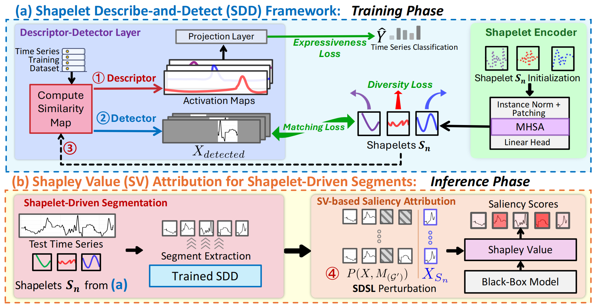

<div align="center">

# ShapeX: Shapelet-Driven Post Hoc Explanations for Time Series Classification Models</b></h2>

<p>
  
  
  
  
</p>


</div>

 **ShapeX** is a **shapelet-driven post hoc explainability framework** for time series classification models.  It reveals **interpretable temporal motifs** learned by deep neural networks, providing **segment-level** and **prototype-level** explanations.


- [🗞️ Updates / News](#️-updates--news)
- [💫 Introduction](#-introduction)
- [🧩 Code Structure](#-code-structure)
- [⚙️ Installation](#️-installation)
- [📂 Paths and Directory Setup](#-paths-and-directory-setup)
- [📊 Datasets](#-datasets)
- [⚡ Configuration and Execution](#-configuration-and-execution)
- [🧠 Pretrained Models and Checkpoints](#-pretrained-models-and-checkpoints)
- [📚 Citation](#-citation)


---

## 🗞️ Updates / News

- 🚩 **Sep 2025**: **ShapeX** accepted at *NeurIPS 2025* 🎉 
 

---

## 💫 Introduction

**ShapeX** introduces a unified **shapelet-based post hoc explanation** framework for deep time series classification models.  
It explains *why* a model makes a prediction by **discovering, describing, and attributing shapelets**—short discriminative subsequences in time series.

<p align="center">
  
</p>

### ✨ Key Highlights

- **Shapelet Describe-and-Detect (SDD) Framework**  
  Learns class-specific shapelets that describe temporal characteristics and detect their occurrences.

- **Model-Agnostic Post Hoc Interface**  
  Compatible with CNNs, Transformers, and LSTMs.

- **Segment-Level Attribution**  
  Uses Shapley-based metrics and perturbation analysis to localize influential time segments.


---

## 🧩 Code Structure

```
ShapeX
├─ runner.py
├─ requirements.txt
├─ configs/
│  ├─ run_configs.yaml
│  ├─ mcce.yaml
│  ├─ mitecg.yaml
│  └─ ...
├─ checkpoints/
│  ├─ classification_models/
│  │  ├─ mcce_transformer.pt
│  │  └─ mitecg_transformer.pt
│  └─ explainer/
├─ datasets/
│  ├─ mcce.pt
│  ├─ freqshape.pt
│  ├─ mitecg/
│  └─ UCR/
├─ shapelet_encoder/        # ProtoPTST and related models
├─ txai/                    # utilities, data loaders, evaluation helpers
└─ evaluate/                # (optional) evaluation/visualization scripts
```

---

## ⚙️ Installation

```bash
pip install -r requirements.txt
```

**Requirements**
- Python ≥ 3.10  
- PyTorch ≥ 2.2  
- CUDA ≥ 11.8 (recommended)  

---

## 📂 Paths and Directory Setup

All paths are derived from a single **root directory** defined in `runner.py` (`base.root_dir`).

**Automatic subpath derivation**
```
Datasets: <root_dir>/datasets
MITECG: <root_dir>/datasets/mitecg
Explainer checkpoints: <root_dir>/checkpoints/explainer
Classifier checkpoints: <root_dir>/checkpoints/classification_models
```

If you add a new classifier, place it here:
```
your_root_path/ShapeX/checkpoints/classification_models
```
and follow the naming convention:
```
mcce_transformer.pt, mitecg_transformer.pt, etc.
```

---

## 📊 Datasets

All datasets should be placed under:
```
your_root_path/ShapeX/datasets
```

**Supported datasets and expected layouts**
- FreqShape-like (including `mcce`, `mcch`, `mtce`, `mtch`):
  - Single-file: `datasets/<name>.pt` (e.g., `datasets/mcce.pt`), or
  - Split-file format: `datasets/split=<id>.pt` (e.g., `split=301.pt`)
- MITEcg:
  - `datasets/mitecg/` with train/test split and labels, e.g.:
    ```
    datasets/
    └─ mitecg/
       ├─ train/
       ├─ test/
       └─ labels.csv
    ```
- UCR archive:
  - `datasets/UCR/<DatasetName>/<DatasetName>_TRAIN.tsv`
  - `datasets/UCR/<DatasetName>/<DatasetName>_TEST.tsv`

---

## ⚡ Configuration and Execution

Configs are located under:
```
ShapeX/configs/
```
- `run_configs.yaml`: datasets list and train/test flags  
- Per-dataset YAMLs define:
  - `num_classes`, `seq_len`, `proto_len`, `num_prototypes`

### 🔧 Example Commands

**Test only**
```bash
python runner.py
```

**Train + Test**
```bash
python runner.py
```
*(Make sure to set train/test flags inside `configs/run_configs.yaml`.)*

---

### 🧠 Pretrained Models and Checkpoints

Pretrained models, and datasets for **ShapeX** are hosted on **Hugging Face**:  
👉 [https://huggingface.co/datasets/bosonhwang/ShapeX](https://huggingface.co/datasets/bosonhwang/ShapeX)

This repository includes:
- 🔹 **Datasets** used in our experiments (`datasets/`)
- 🔹 **Pretrained classifiers** and **ShapeX explainers** (`checkpoints/`)

You can download or directly load them via the `huggingface_hub` API:
```python
from huggingface_hub import snapshot_download
snapshot_download(repo_id="bosonhwang/ShapeX", repo_type="dataset")
```
---

## 📚 Citation

If you find this work useful, please cite:

```
@inproceedings{huang2025shapex,
  title     = {ShapeX: Shapelet-Driven Post Hoc Explanations for Time Series Classification Models},
  author    = {Huang, Bosong and Jin, Ming and Liang, Yuxuan and Barthelemy, Johan and Cheng, Debo and Wen, Qingsong and Liu, Chenghao and Pan, Shirui},
  booktitle = {Proceedings of the 39th Conference on Neural Information Processing Systems (NeurIPS)},
  year      = {2025}
}
```

---
